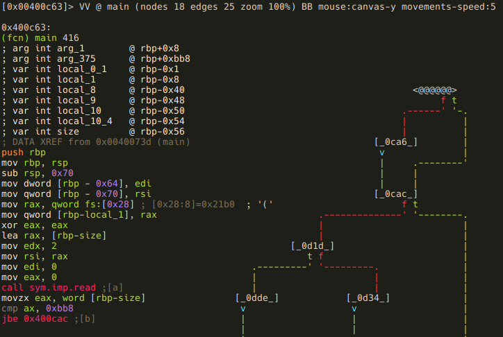
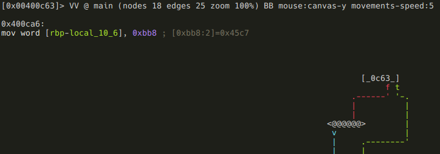
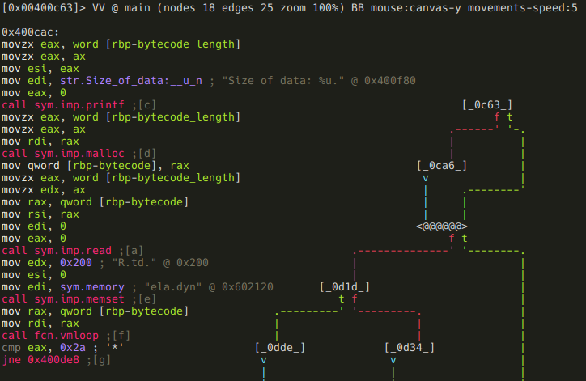
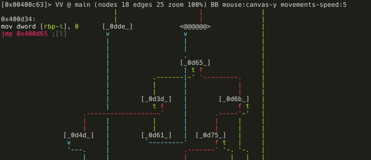

### .main

As I was saying, I usually take a look at the entry point, so let's just do
that:

```
[0x00400720]> s main
[0x00400c63]>
```

> ***r2 tip:*** You can go to any offset, flag, expression, etc. in the
> executable using the *s* command (seek). You can use references, like *$$*
> (current offset), you can undo (*s-*) or redo (*s+*) seeks, search strings
> (*s/ [string]*) or hex values (*s/x 4142*), and a lot of other useful stuff.
> Make sure to check out *s?*!

Now that we are at the beginning of the main function, we could use *p* to show
a disassembly (*pd*, *pdf*), but r2 can do something much cooler: it has a
visual mode, and it can display graphs similar to IDA, but way cooler, since
they are ASCII-art graphs :)

> ***r2 tip:*** The command family *p* is used to print stuff. For example it can
> show disassembly (*pd*), disassembly of the current function (*pdf*), print
> strings (*ps*), hexdump (*px*), base64 encode/decode data (*p6e*, *p6d*), or
> print raw bytes (*pr*) so you can for example dump parts of the binary to other
> files. There are many more functionalities, check *?*!

R2 also has a minimap view which is incredibly useful for getting an overall
look at a function:


> ***r2 tip:*** With command *V* you can enter the so-called visual mode, which
> has several views. You can switch between them using *p* and *P*. The graph
> view can be displayed by hitting *V* in visual mode (or using *VV* at the
> prompt).
>
> Hitting *p* in graph view will bring up the minimap. It displays the
> basic blocks and the connections between them in the current function, and it
> also shows the disassembly of the currently selected block (marked with @@@@@
> on the minimap). You can select the next or the previous block using the
> \*\<TAB\>\* and the \*\<SHIFT\>\<TAB\>\* keys respectively. You can also
> select the true or the false branches using the *t* and the *f* keys.
>
> It is possible to bring up the prompt in visual mode using the *:* key, and
> you can use *o* to seek.

Lets read main node-by-node! The first block looks like this:



We can see that the program reads a word (2 bytes) into the local variable named
*local_10_6*, and than compares it to 0xbb8. That's 3000 in decimal:

```
[0x00400c63]> ? 0xbb8
3000 0xbb8 05670 2.9K 0000:0bb8 3000 10111000 3000.0 0.000000f 0.000000
```

> ***r2 tip***: yep, *?* will evaluate expressions, and print the result in
> various formats.

If the value is greater than 3000, then it will be forced to be 3000:



There are a few things happening in the next block:


First, the "Size of data: " message we saw when we run the program is printed.
So now we know that the local variable *local_10_6* is the size of the input
data - so lets name it accordingly (remember, you can open the r2 shell from
visual mode using the *:* key!):

```
:> afvn local_10_6 input_size
```

> ***r2 tip***: The *af* command family is used to analyze functions. This
> includes manipulating arguments and local variables too, which is accessible
> via the *afv* commands. You can list function arguments (*afa*),  local
> variables (*afv*), or you can even rename them (*afan*, *afvn*). Of course
> there are lots of other features too - as usual: use the "?", Luke!

After this an *input_size* bytes long memory chunk is allocated, and filled with
data from the standard input. The address of this memory chunk is stored in
*local_10* - time to use *afvn* again:

```
:> afvn local_10 input_data
```

We've almost finished with this block, there are only two things remained.
First, an 512 (0x200) bytes memory chunk is zeroed out at offset 0x00602120.
A quick glance at XREFS to this address reveals that this memory is indeed used
somewhere in the application:

```
:> axt 0x00602120
d 0x400cfe mov edi, 0x602120
d 0x400d22 mov edi, 0x602120
d 0x400dde mov edi, 0x602120
d 0x400a51 mov qword [rbp - 8], 0x602120
```

Since it probably will be important later on, we should label it:

```
:> f sym.memory 0x200 0x602120
```

> ***r2 tip***: Flags can be managed using the *f* command family. We've just
> added the flag sym.memory to a 0x200 bytes long memory area at 0x602120. It is
> also possible to remove (*f-name*), rename (*fr [old] [new]*), add comment
> (*fC [name] [cmt]*) or even color (*fc [name] [color]*) flags.

While we are here, we should also declare that memory chunk as data, so it will
show up as a hexdump in disassembly view:

```
:> Cd 0x200 @ sym.memory
```

> ***r2 tip***: The command family *C* is used to manage metadata. You can set
> (*CC*) or edit (*CC*) comments, declare memory areas as data (*Cd*), strings
> (*Cs*), etc. These commands can also be issued via a menu in visual mode
> invoked by pressing *d*.

The only remaining thing in this block is a function call to 0x400a45 with the
input data as an argument. The function's return value is compared to "*", and
a conditional jump is executed depending on the result.

Earlier I told you that this crackme is probably based on a virtual machine.
Well, with that information in mind, one can guess that this function will be
the VM's main loop, and the input data is the instructions the VM will execute.
Based on this hunch, I've named this function *vmloop*, and renamed
*input_data* to *bytecode* and *input_size* to *bytecode_length*. This is not
really necessary in a small project like this, but it's a good practice to name
stuff according to their purpose (just like when you are writing programs).

```
:> af vmloop 0x400a45
:> afvn input_size bytecode_length
:> afvn input_data bytecode
```

> ***r2 tip***: The *af* command is used to analyze a function with a given name
> at the given address. The other two commands should be familiar from earlier.

After renaming local variables, flagging that memory area, and renaming the VM
loop function the disassembly looks like this:



So, back to that conditional jump. If *vmloop* returns anything else than "*",
the program just exits without giving us our flag. Obviously we don't want that,
so we follow the false branch.


Now we see that a string in that 512 bytes memory area (*sym.memory*) gets
compared to "Such VM! MuCH reV3rse!". If they are not equal, the program prints
the bytecode, and exits:


OK, so now we know that we have to supply a bytecode that will generate that
string when executed. As we can see on the minimap, there are still a few more
branches ahead, which probably means more conditions to meet. Lets investigate
them before we delve into *vmloop*!

If you take a look at the minimap of the whole function, you can probably
recognize that there is some kind of loop starting at block *[_0d34_]*, and it
involves the following nodes:

- [_0d34_]
- [_0d65_]
- [_0d3d_]
- [_0d61_]

Here are the assembly listings for those blocks. The first one puts 0 into local
variable *local_10_4*:



And this one compares *local_10_4* to 8, and executing a conditional jump based
on the result:


It's pretty obvious that *local_10_4* is the loop counter, so lets name it
accordingly:

```
:> afvn local_10_4 i
```

Next block is the actual loop body:


The memory area at 0x6020e0 is treated as an array of dwords (4 byte values),
and checked if the ith value of it is zero. If it is not, the loop simply
continues:


If the value is zero, the loop breaks and this block is executed before exiting:


It prints the following message: Use everything!" As we've established earlier,
we are dealing with a virtual machine. In that context, this message probably
means that we have to use every available instructions. Whether we executed an
instruction or not is stored at 0x6020e0 - so lets flag that memory area:

```
:> f sym.instr_dirty 4*9 0x6020e0
```

Assuming we don't break out and the loop completes, we are moving on to some
more checks:


This piece of code may look a bit strange if you are not familiar with x86_64
specific stuff. In particular, we are talking about RIP-relative addressing,
where offsets are described as displacements from the current instruction
pointer, which makes implementing PIE easier. Anyways, r2 is nice enough to
display the actual address (0x602104). Got the address, flag it!

```
:> f sym.good_if_ne_zero 4 0x602104
```

Keep in mind though, that if RIP-relative addressing is used, flags won't appear
directly in the disassembly, but r2 displays them as comments:


If *sym.good_if_ne_zero* is zero, we get a message ("Your getting closer!"), and
then the program exits. If it is non-zero, we move to the last check:


Here the program compares a dword at 0x6020f0 (again, RIP-relative addressing)
to 9. If its greater than 9, we get the same "Your getting closer!" message, but
if it's lesser, or equal to 9, we finally reach our destination, and get the flag:


As usual, we should flag 0x6020f0:

```
:> f sym.good_if_le_9 4 0x6020f0
```

Well, it seems that we have fully reversed the main function. To summarize it:
the program reads a bytecode from the standard input, and feeds it to a virtual
machine. After VM execution, the program's state have to satisfy these
conditions in order to reach the goodboy code:

- *vmloop*'s return value has to be "*"
- *sym.memory* has to contain the string "Such VM! MuCH reV3rse!"
- all 9 elements of *sym.instr_dirty* array should not be zero (probably means
  that all instructions had to be used at least once)
- *sym.good_if_ne_zero* should not be zero
- *sym.good_if_le_9* has to be lesser or equal to 9

This concludes our analysis of the main function, we can now move on to the VM
itself.
