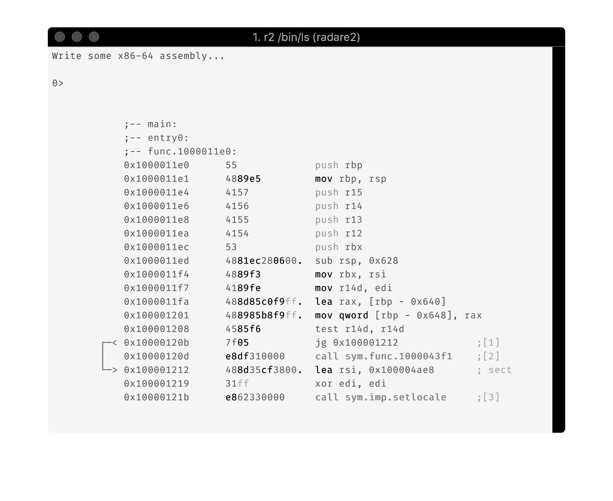
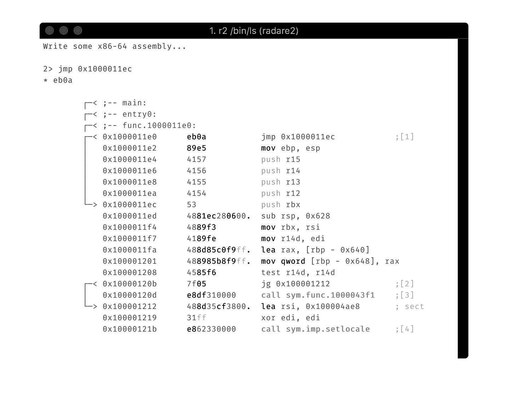

## Visual Assembler

You can use Visual Mode to assemble code pressing the `A` key inside the `V`isual mode (or just type `VA` from the shell). Note that the cursor mode also plays well with the visual assembler, use it to point to the instruction that you want to patch insted of just scrolling up and down changing the seek.

For example let's replace the `push` by a `jmp`:

Notice the preview of the disassembly and arrows:

In order to patch the file you must open it in read-write mode (`r2 -w`), but if you are inside radare2, you can reopen the file in rw mode with `oo+`.

You can also use the cache mode: `e io.cache = true` and `wc?`.

**Note** that when you are debugging, patching the memory won't modify the files in disk.
